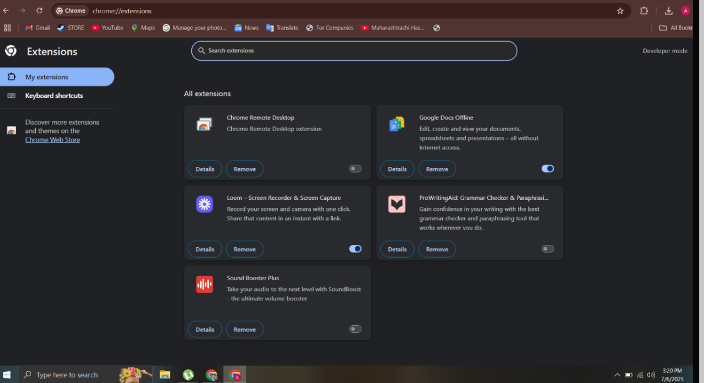
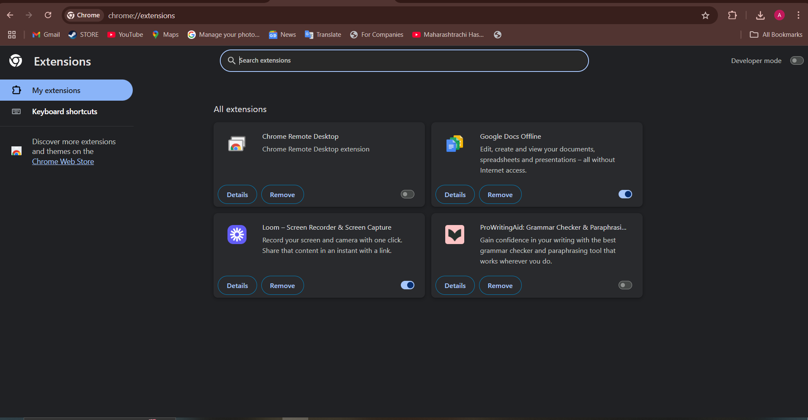

# Cyber Security Internship – Task 7

## Task: Identify and Remove Suspicious Browser Extensions

### Objective:
To understand the risks posed by browser extensions, learn how to inspect them, and remove any suspicious or unused ones to improve browser security.

---

## Tools Used:
- **Google Chrome** (for extension review and removal)

---

## 🔎 Step-by-Step Actions Taken:

### 1. **Reviewed Installed Extensions**
Checked all extensions under `chrome://extensions/`. The following extensions were installed:

| Extension Name                         | Status     | Reasoning                                               |
|----------------------------------------|------------|---------------------------------------------------------|
| Chrome Remote Desktop                  | ✅ Kept     | Trusted Google extension, official and useful           |
| Google Docs Offline                    | ✅ Kept     | Safe for offline document access                        |
| Loom – Screen Recorder & Screen Capture| ✅ Kept     | Reputable screen recording tool                         |
| ProWritingAid: Grammar Checker         | ✅ Kept     | Trusted grammar checker with strong reviews             |
| Sound Booster Plus                     | ❌ Removed  | Mixed reviews, flagged for potential malware            |

---

### 2. **Checked Permissions & Reviews**
- Used the Chrome Web Store to check each extension's ratings and permissions.
- Removed **Sound Booster Plus** because:
  - It requested powerful permissions
  - Had several reports of poor performance and potential malware
  - Received user complaints about adware and tracking

---

### 3. **Restarted the Browser**
After removing the suspicious extension, Chrome was restarted to ensure all changes took effect.

---

## How Malicious Extensions Can Harm Users

### What Are Malicious Extensions?
Malicious browser extensions often appear helpful but misuse their permissions to carry out harmful actions in the background.

### Common Dangers:
- **Data Theft:** They can read passwords, credit card info, and form data.
- **Tracking:** They monitor and sell your browsing behavior.
- **Ad Injections:** They inject ads or redirect you to phishing websites.
- **Keystroke Logging:** They can record everything you type.
- **Malware Downloads:** Some can silently install harmful software.

### Real-Life Case:
- In 2020, over 100 Chrome extensions were banned for secretly collecting user data.
- The **"DataSpii"** leak involved several extensions capturing sensitive data from millions.

---

## 📚 What I Learned:
- How to critically inspect browser extensions for safety.
- The importance of permissions and user reviews.
- How malicious extensions operate and why browser hygiene matters.
- Confidence in reviewing and managing browser add-ons securely.

---

## 📸 Screenshots:

### 🖼️ Before Removing Suspicious Extension

### 🖼️ After Removing Sound Booster Plus

---

## Final Result:
- **1 suspicious extension identified and removed**
- **Browser security improved**
- **Awareness of extension-based risks developed**

